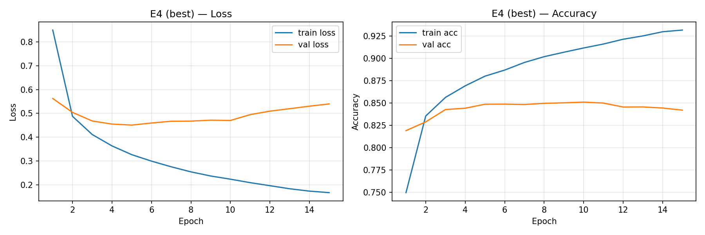
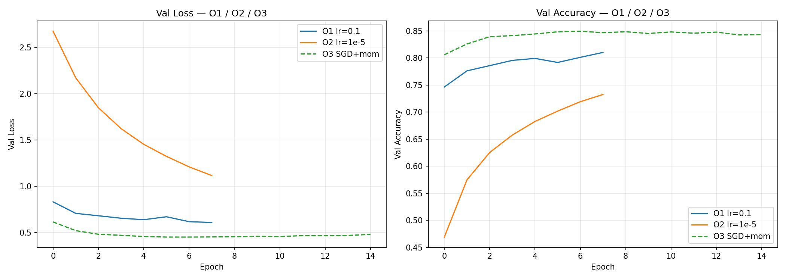
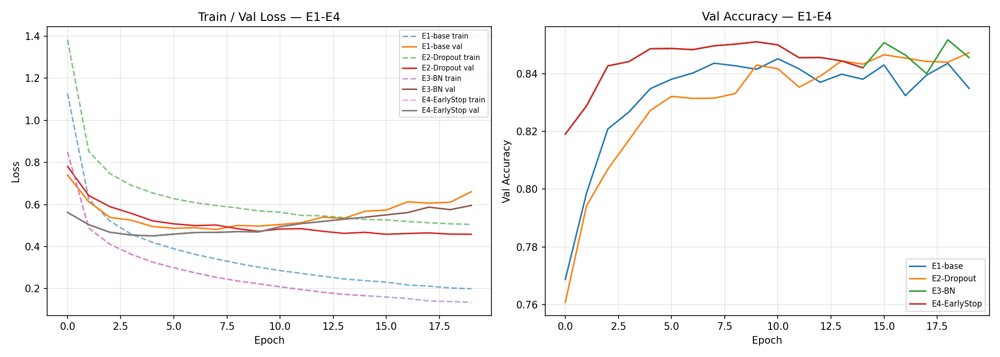

# HW08-09 – PyTorch MLP: регуляризация и оптимизация обучения

## 1. Кратко: что сделано

- Выбран датасет **Вариант B — EMNIST Balanced** (47 классов рукописных символов). Выбор обусловлен недоступностью KMNIST для скачивания (ни с vpn, ни без и даже некторые зеркала недоступны); EMNIST Balanced — достаточно сложная задача для MLP (47 классов vs 10 у KMNIST).
- В части A (регуляризация) сравнивались: базовая MLP (E1), Dropout (E2), BatchNorm (E3), лучший вариант + EarlyStopping (E4).
- В части B (оптимизация) проведена диагностика LR: слишком большой (O1), слишком маленький (O2), а также SGD+momentum+weight_decay (O3).

## 2. Среда и воспроизводимость

- Python: 3.12
- torch / torchvision: 2.10.0 / 0.25.0
- Устройство: CPU
- Seed: 42 (`torch.manual_seed`, `numpy.random.seed`)
- Как запустить: открыть `HW08-09.ipynb` и выполнить Run All.

## 3. Данные

- Датасет: EMNIST Balanced (`torchvision.datasets.EMNIST(split="balanced")`)
- Разделение: 90 240 train / 22 560 val (80/20 из train-части, `random_split` с seed=42) + 18 800 test (стандартный test из torchvision)
- Трансформации: `Compose([ToTensor(), Normalize((0.5,), (0.5,))])` — диапазон [-1, 1]
- EMNIST Balanced содержит 47 классов (цифры 0-9 и буквы), изображения 1x28x28 в градациях серого. Задача сложнее MNIST/KMNIST из-за большего числа классов и визуальной схожести символов.

## 4. Базовая модель и обучение

- Модель MLP: Flatten -> Linear(784, 512) -> ReLU -> Linear(512, 256) -> ReLU -> Linear(256, 47)
- Loss: CrossEntropyLoss
- Базовый Optimizer (для части A): Adam (lr=1e-3)
- Batch size: 128
- Epochs (макс): 20 (E1-E3), 30 (E4 с EarlyStopping)
- EarlyStopping: patience=5, metric=val_accuracy (min_delta=0.0005)

## 5. Часть A (S08): регуляризация (E1-E4)

- **E1 (base)**: [512, 256] ReLU, без Dropout, без BatchNorm -> val_acc = **0.8452**
- **E2 (Dropout)**: как E1 + Dropout(p=0.3) после каждого ReLU -> val_acc = **0.8473**
- **E3 (BatchNorm)**: как E1 + BatchNorm1d перед каждым ReLU -> val_acc = **0.8517**
- **E4 (EarlyStopping)**: E3 (лучший: 0.8517 > 0.8473) + EarlyStopping (patience=5) -> val_acc = **0.8510**, остановка на эпохе **15** из 30

## 6. Часть B (S09): LR, оптимизаторы, weight decay (O1-O3)

- **O1**: Adam, lr=**0.1** (слишком большой) — 8 эпох -> val_acc = **0.8102**
- **O2**: Adam, lr=**1e-5** (слишком маленький) — 8 эпох -> val_acc = **0.7325**
- **O3**: SGD, momentum=**0.9**, weight_decay=**1e-4**, lr=**0.01** — 15 эпох -> val_acc = **0.8494**

## 7. Результаты

Ссылки на файлы в репозитории:

- Таблица результатов: [`./artifacts/runs.csv`](./artifacts/runs.csv)
- Лучшая модель: [`./artifacts/best_model.pt`](./artifacts/best_model.pt)
- Конфиг лучшей модели: [`./artifacts/best_config.json`](./artifacts/best_config.json)
- Кривые лучшего прогона: [`./artifacts/figures/curves_best.png`](./artifacts/figures/curves_best.png)
- Кривые "плохих LR": [`./artifacts/figures/curves_lr_extremes.png`](./artifacts/figures/curves_lr_extremes.png)

Короткая сводка:

- Лучший эксперимент части A: **E3 (BatchNorm)** по val_accuracy; E4 (EarlyStopping на основе E3) — итоговая лучшая модель.
- Лучшая val_accuracy: **0.8517** (E3), **0.8510** (E4 с ранней остановкой).
- Итоговая test_accuracy (для лучшей модели E4): **0.8470**.
- O1 (lr=0.1): loss осциллирует, val_acc нестабилен, модель не сходится к хорошему минимуму.
- O2 (lr=1e-5): loss снижается крайне медленно, за 8 эпох val_acc достигает лишь 0.73 — обучение едва двигается.
- O3 (SGD+momentum+wd): val_acc = 0.8494 за 15 эпох, что сопоставимо с Adam (E1: 0.8452). SGD с momentum дает стабильную сходимость, weight decay мягко регуляризирует веса.

## 8. Анализ

В эксперименте E1 (base) наблюдается переобучение: train_loss стабильно снижается, тогда как val_loss начинает расти после достижения минимума — разрыв между train и val loss увеличивается с каждой эпохой. Dropout (E2, p=0.3) уменьшает разрыв train/val loss, вынуждая сеть не полагаться на отдельные нейроны; val_acc (0.8473) оказалась чуть выше базовой E1 (0.8452), что подтверждает мягкий регуляризирующий эффект. BatchNorm (E3) показал лучший результат (val_acc = 0.8517): нормализация внутренних активаций стабилизирует обучение и ускоряет сходимость — уже на первых эпохах E3 опережает E1.

EarlyStopping в E4 остановил обучение на 15-й эпохе (patience=5). Это предотвратило дальнейшее переобучение: val_acc E4 (0.8510) практически совпадает с пиком E3 (0.8517), поскольку E4 — это новый прогон с ранней остановкой, а не продолжение E3; небольшой разброс обусловлен стохастичностью обучения.

O1 (lr=0.1) демонстрирует типичную картину завышенного LR: loss и accuracy осциллируют между эпохами, модель прыгает между минимумами и не может стабильно сойтись. O2 (lr=1e-5) показывает заниженный LR: за 8 эпох loss снизился незначительно, val_acc достиг лишь 0.73 — обучение движется, но слишком медленно при ограниченном бюджете эпох.

SGD+momentum (O3) с lr=0.01 и weight_decay=1e-4 достиг val_acc = 0.8494, что практически идентично лучшему E3 (0.8517). Weight decay добавляет L2-регуляризацию, ограничивая рост весов и улучшая обобщение. Momentum (0.9) сглаживает траекторию оптимизации и помогает преодолевать локальные минимумы.

Выбранный лучший конфиг (BatchNorm + EarlyStopping + Adam lr=1e-3) разумен для EMNIST Balanced: BatchNorm компенсирует internal covariate shift, а EarlyStopping не дает переобучиться при 47 классах с ограниченным объемом данных на класс (~2400 примеров/класс в train).

## 9. Итоговый вывод

В качестве базового конфига для EMNIST Balanced рекомендуется MLP [512, 256] + BatchNorm + Adam (lr=1e-3) + EarlyStopping (patience=5). Этот конфиг обеспечивает val_acc = 0.8510, test_acc = 0.8470 при остановке на 15-й эпохе — хороший баланс между скоростью обучения и качеством обобщения.

Для дальнейшего улучшения стоит попробовать: (1) комбинацию BatchNorm + Dropout с меньшим p (0.1-0.2) — они могут работать аддитивно; (2) переход на сверточную архитектуру (CNN), которая лучше использует пространственную структуру изображений 28x28.

## 10. Приложение (опционально)

Дополнительный график сравнения всех экспериментов части A: [`./artifacts/figures/curves_partA.png`](./artifacts/figures/curves_partA.png)

